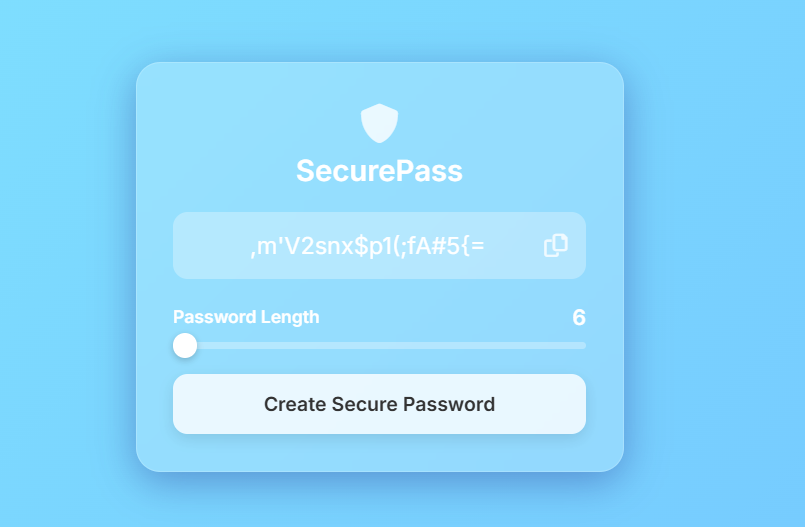

# 🔐 SecurePass Password Generator Project

## 📌 Project Overview
This project focuses on building a sleek, client-side web application that generates secure, randomized passwords. Using modern web development techniques, the project explores how to create an Apple-inspired "glassmorphism" user interface while utilizing Vanilla JavaScript to handle password randomization, length constraints, and direct clipboard integration.

## 🎯 Objective
* Build a fully functional password generator using HTML, CSS, and JavaScript
* Implement a modern, responsive Glassmorphism UI
* Create dynamic range slider controls for password length
* Integrate the Web Clipboard API for one-click copying
* Generate actionable visual feedback for user interactions

## 🛠️ Tech Stack & Tools

**💻 Programming Languages**
* HTML5
* CSS3
* Vanilla JavaScript (ES6+)

**📚 Libraries Used**
* Google Fonts (Inter)
* FontAwesome (for UI icons)

**🧰 Tools**
* VS Code
* Git & GitHub
* Modern Web Browser (Chrome, Safari, Firefox)

## 📂 Project Structure
```text
SecurePass-Generator/
│
├── index.html           (Main HTML, CSS, and JS)
├── images/
│   └── (Ouput screenshots)
│
└── README.md
```

## ⚙️ Project Workflow
1️⃣ Core Structure (HTML)

Created the semantic skeleton of the application

Integrated external CDNs for fonts and icons

 2️⃣ Styling & UI (CSS)

Applied the animated gradient background

Built the frosted glass effect using backdrop-filter

Customized the range slider to look modern and minimalistic

3️⃣ Application Logic (JavaScript)

Created character pools (letters, numbers, symbols)

Built the randomization loop based on slider input

Linked the generate button to update the DOM

4️⃣ Interactivity & Feedback

Integrated the navigator.clipboard API

Added temporary "Copied!" visual feedback using CSS transitions

## 📊 Key Features & Insights
📌 Zero Dependencies: Runs entirely in the browser without a backend or frameworks

📌 Highly Secure: Passwords are generated strictly on the client-side, ensuring data privacy

📌 Customizable Length: Users can slide between 6 and 32 characters dynamically

📌 Glassmorphism Design: Uses modern CSS properties for a clean, premium feel

📌 Instant Feedback: Micro-animations provide immediate confirmation when copying

## 📈 Sample Visualizations
🎬 Main Interface


## 🚀 Bonus Feature
A smooth, continuous 15-second animated gradient background built purely with CSS @keyframes to enhance the premium feel of the application.

## ▶️ How to Run This Project

Step 1: Clone Repository

```
Bash
git clone [https://github.com/shruti875/Password-Generator.git](https://github.com/shruti875/Password-Generator.git)
Step 2: Navigate to Project Folder
Bash
cd SecurePass-Generator

Step 3: Open in Browser
You don't need any local servers! Simply double-click the index.html file to open it in your default web browser.
```

## 📦 requirements.txt
No Python or Node.js requirements needed! Just a standard, modern web browser.

## 💡 Learning Outcomes
Practical understanding of DOM manipulation using JavaScript

Hands-on experience with modern CSS (Glassmorphism, Flexbox, Custom Inputs)

Ability to integrate browser APIs (Clipboard API)

Improved skills in front-end micro-interactions and user feedback

Experience in creating standalone, serverless web utilities

## 📌 Future Improvements
Add a visual password strength meter (Weak, Medium, Strong)

Include individual toggle checkboxes for Uppercase, Numbers, and Symbols

Deploy the project live using GitHub Pages or Vercel

Implement a Dark/Light mode toggle switch

## 🤝 Contribution
Contributions are welcome! Feel free to fork this repository and enhance the project.

## 📬 Contact
If you found this project useful or have suggestions, feel free to connect!

## ⭐ If you like this project, don't forget to give it a star!
